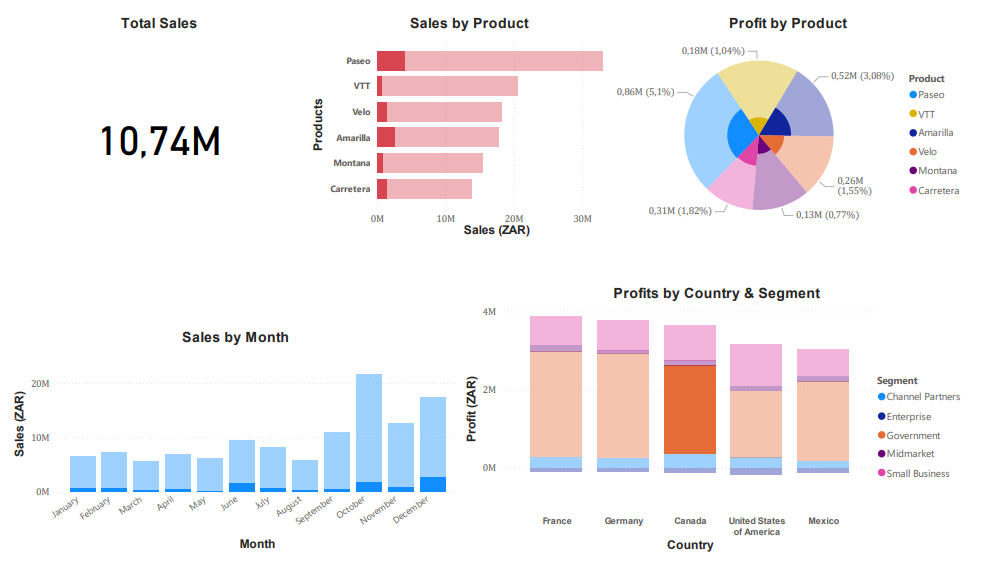

# PROJECTS
 

This repo holds some of the projects I have done to showcase my learning journey and experience. These projects were done in the following programming languages :
- R / RStudio
- Power BI.

## BRIEF DESCRIPTION
#### 1. BMD Analysis
This project uses the most recent and effective method of dealing with missing data and recovering(predicting) 25% of the data that was missing, greatly improving the quality of the data and reliability of future tests to be ran on that dataset.
#### 2. Employee's Satisfaction
The analyses investigates how gender and education affects the happiness of an emplpoyee at a certain company, using Data Analysis techniques and one similar to A/B testing.
#### 3. Finance Dashboard
Using Power BI, I was able to create an interactive dashboard that a team can constantly update with ease and consult to make decisions.

## License
This project is licensed under the [MIT License](LICENSE). 
<!---
## ABOUT ME

 I’m mainly interested in both the theory & applications of Mathematics & Statistics, as well as applications of, and innovative ideas in tech. 
 I’m currently learning C++, as well as Web Development & Artificial Intelligence(AI). I’m looking forward to collaborate on projects using 
 - HTML & CSS 
 - R/RStudio, 
 - Manim(Python)
 - PostgreSQL/SQL
 - & later C++.

  [ You can also hit me up for any crazy idea or project, im always up for challenges. No illegal stuff🥴]

- 📫 You can send me a message on LinkedIn or via email to collaborate[links on my prpofile].

- Enjoy the rest of your day🤟🏾

Katleho-Nyoni/Katleho-Nyoni is a ✨ special ✨ repository because its `README.md` (this file) appears on your GitHub profile.
You can click the Preview link to take a look at your changes.
--->

---

<!-- Proudly created with GPRM ( https://gprm.itsvg.in ) -->
